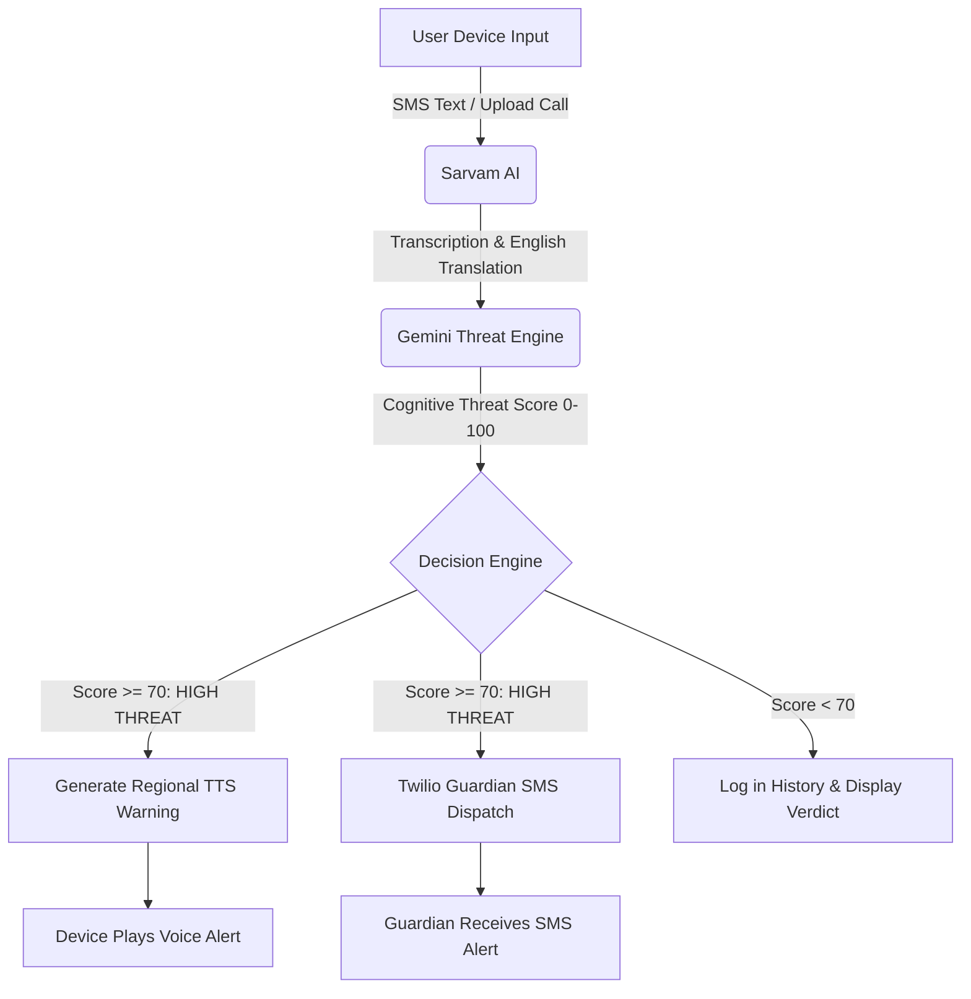

# Kavach-AI (कवच-AI)

<div align="center">

[](LICENSE)
[](https://nextjs.org/)
[](https://fastapi.tiangolo.com/)
[](https://www.twilio.com/)
[](https://deepmind.google/technologies/gemini/)

### **Real-Time Fraud & Social Engineering Protection with Voice Warning & Guardian Alerts**

*An intelligent, localized security shield designed to protect vulnerable individuals from voice phishing, SMS scams, and social engineering frauds.*

</div>

---

## 📋 Table of Contents
1. [Tagline & Introduction](#-tagline--introduction)
2. [Problem Statement](#-problem-statement)
3. [Solution Overview](#-solution-overview)
4. [Key Features](#-key-features)
5. [System Architecture & Workflow](#-system-architecture--workflow)
6. [Technology Stack](#-technology-stack)
7. [API Integrations](#-api-integrations)
8. [Installation & Setup Guide](#-installation--setup-guide)
9. [Environment Variables Setup](#-environment-variables-setup)
10. [Demo Test Scenarios](#-demo-test-scenarios)
11. [Visual Showcase (Screenshots)](#-visual-showcase-screenshots)
12. [Future Scope](#-future-scope)
13. [Team Members](#-team-members)
14. [License](#-license)

---

## 💡 Tagline & Introduction
**"Family-Bound Cybersecurity Armor for the Vulnerable."**

Kavach-AI is an end-to-end device protection application that integrates advanced AI intelligence, real-time audio/text translation, and fallback guardian notifications to safeguard vulnerable users (such as senior citizens) against modern, high-tech financial fraud.

---

## ⚠️ Problem Statement
Digital financial fraud is skyrocketing. Scammers utilize sophisticated social engineering scripts—often in regional Indian languages—to target retirees, parents, and non-tech-savvy individuals. These attacks (banking verification blocks, KBC lotteries, pension account threats, electricity cut-offs) exploit panic and lack of tech familiarity.
* **Traditional filters fail**: Traditional spam filters only block known spam numbers and do not assess content meaning.
* **Vulnerable demographic**: When targeted, senior citizens often panic and make transfers before consulting their families.
* **Localization gap**: Scammers communicate in local regional dialects, which standard NLP tools do not process effectively.

---

## 🛡️ Solution Overview
Kavach-AI bridges the gap by acting as a zero-trust intermediary shield:
1. **User Verification**: Secures device identity registration using Twilio Verify OTP authentication.
2. **Multi-Input Translation**: Ingests SMS texts or uploads recorded audio calls, leveraging **Sarvam AI** to transcribe local speech and normalize inputs to English.
3. **AI Threat Evaluation**: Leverages **Google Gemini Flash** to perform structured cognitive risk modeling and render a threat score (0-100) and risk verdict.
4. **Active Local Warning**: If a high-threat scam is detected, Kavach-AI immediately synthesizes a local language text-to-speech alarm (using **Sarvam TTS**) and plays it to warn the user in their preferred dialect (e.g. Hindi, Telugu, etc.).
5. **Guardian Alert Routing**: Dispatches a real-time SMS warning using **Twilio SMS** to a designated family member (guardian), ensuring immediate family intervention before financial transactions occur.

---

## ✨ Key Features
* **SMS Verification & Bindings**: Quick OTP login using Twilio Verify ensures valid device activation.
* **Onboarding & Profile Persistence**: Binds user details, warning language, and guardian settings. Prevents dashboard bypass until profile setup is complete.
* **Audio Call Transcription & Translation**: Converts local dialects to text and normalizes them for cognitive analysis.
* **Gemini cognitive threat scoring**: Structured response format (JSON) identifying scam taxonomy, confidence scores, and reasoning.
* **Dynamic Threat Aesthetics**: The UI dynamically updates styling (Green: Safe, Yellow: Suspicious, Red: High Threat with warning alarms).
* **Localized Audio Warnings**: Plays spoken audio warnings in the user's preferred Indian language.
* **Twilio Guardian SMS Alerting**: Sends structured SMS alerts containing the user's name, threat type, and score directly to their guardian.
* **Incident logs history**: Keeps track of all scans for family review.

---

## 🏗️ System Architecture & Workflow

### Architecture Diagram

For deep architectural details, Sequence Flows, and Data schemas, see [ARCHITECTURE.md](ARCHITECTURE.md).

---

## 💻 Technology Stack
* **Frontend**: Next.js (React), Tailwind CSS / Vanilla CSS, Framer Motion (Transitions & Particles).
* **Backend**: Python, FastAPI, Uvicorn, Local JSON DB (File-based database).
* **Communication & Verification**: Twilio Verify API, Twilio SMS API.
* **AI Pipelines**: Sarvam STT (Speech-to-Text), Sarvam Translate (Text-Translation), Sarvam TTS (Text-to-Speech), Google Gemini API (Cognitive evaluation).

---

## 🔌 API Integrations
1. **Twilio Verify**: Provides phone authentication and OTP code delivery.
2. **Twilio SMS**: Dispatches outgoing emergency alerts to the guardian's mobile number.
3. **Sarvam Translation & Speech-to-Text**: Normalizes local-language phone recordings into English text.
4. **Sarvam Text-to-Speech**: Generates natural regional voice warnings.
5. **Gemini Flash (Google DeepMind)**: Performs threat scoring, classification, and reason flags.

---

## 🚀 Installation & Setup Guide

### 1. Prerequisites
Ensure you have Node.js (v18+) and Python (v3.10+) installed.

### 2. Run Backend Setup
```bash
cd backend
python -m venv venv
# Windows (PowerShell)
.\venv\Scripts\Activate.ps1
# Mac/Linux
source venv/bin/activate
# Install requirements
pip install -r requirements.txt
# Run FastAPI Server
python -m uvicorn app.main:app --reload
```
The API server runs on `http://localhost:8000`.

### 3. Run Frontend Setup
```bash
cd frontend
npm install
npm run dev
```
The frontend portal runs on `http://localhost:3000`.

---

## ⚙️ Environment Variables Setup

Create a `.env` file inside the `backend/` directory:
```env
PORT=8000
HOST=0.0.0.0
GEMINI_API_KEY=your_gemini_api_key
SARVAM_API_KEY=your_sarvam_api_key
TWILIO_ACCOUNT_SID=your_twilio_sid
TWILIO_AUTH_TOKEN=your_twilio_token
TWILIO_PHONE_NUMBER=your_twilio_number
TWILIO_VERIFY_SERVICE_SID=your_verify_service_sid
```

Create a `.env` file inside the `frontend/` directory:
```env
NEXT_PUBLIC_BACKEND_URL=http://localhost:8000
```
For further deployment instructions, check [DEPLOYMENT.md](DEPLOYMENT.md).

---

## 🧪 Demo Test Scenarios
To assess Kavach-AI, use these inputs on the dashboard:
* **Banking SMS Scam (Hindi)**: `प्रिय ग्राहक, आपका SBI योनो खाता ब्लॉक हो गया है। कृपया अपने विवरण को अपडेट करने के लिए तुरंत इस लिंक पर क्लिक करें: http://sbi-verify-kyc.net/login.php`
  * *Expected Result*: High Threat, plays audio alert, sends Twilio Guardian Alert SMS.
* **Lottery Call Scam (Hindi Audio)**: Record or upload an audio call claiming a lottery prize.
  * *Expected Result*: High Threat, transcribes Hindi, translates, triggers warning & guardian alert.
* **Personal Conversation (Safe)**: `Mom, I am reaching the station. See you in 10 minutes.`
  * *Expected Result*: Safe Verdict, green UI response.

For a detailed script and more test cases, see the [Demo Guide](demo/demo_guide.md).

---

## 📸 Visual Showcase (Screenshots)

Below are actual visual screens showcasing the Kavach-AI device protection panel:

| 🛡️ Dashboard Panel | 📩 SMS Analysis Input |
|:---:|:---:|
|  |  |

| 🎙️ Voice Threat Analysis | 🔴 Threat Detection Result (Red Pulse) |
|:---:|:---:|
|  |  |

| 📜 Incident logs history | ⚙️ Profiles & Configuration Settings |
|:---:|:---:|
|  |  |

---

## 🔮 Future Scope
* **Real-time On-Device Call Interception**: Running local Android/iOS dialer services.
* **Multi-Guardian Alert System**: Routing escalation warnings to multiple family members.
* **Local Edge SLM Models**: Processing evaluations completely offline for zero data exposure.
* **Active Call Blocker**: Automatic caller rejection for known fraud profiles.

---

## 👥 Team Credits
**Built By:**
* **Harshavardhan-SHub**
* **Krishnasaivarmakalidindi**
* **somanadh98**
* **saaisanthoshkumaar**

**Developed for:**
* **Takeover Hackathon - NIAT**
  

---

## ⚖️ License
This project is licensed under the **MIT License** - see the [LICENSE](LICENSE) file for details.
